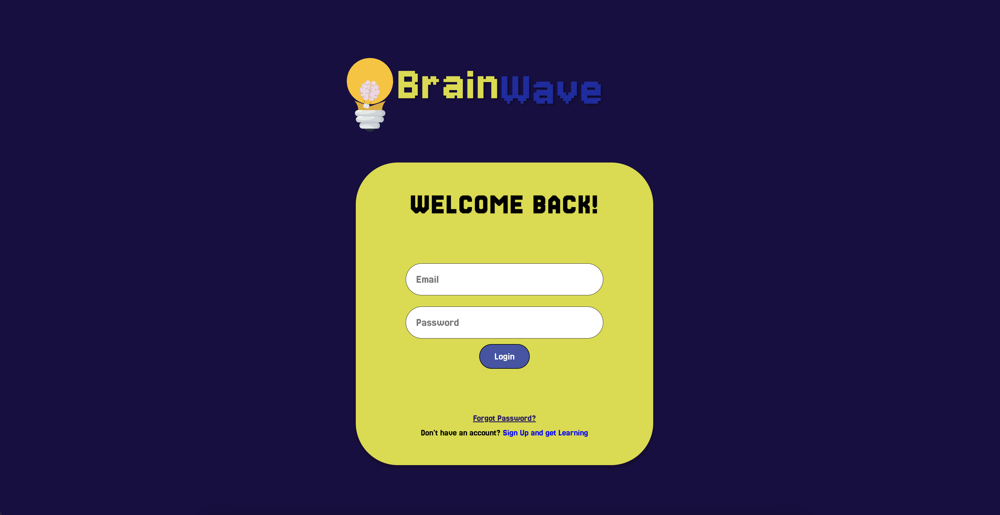

# BrainWave



BrainWave is an educational social media platform designed to foster learning and collaboration. This platform includes features like classroom integration, microlearning, content filtering, and project portfolios.

## Features
- **Chat, Reels, Posts**: Engage with educational content in an interactive format.
- **Club Accounts**: Collaborative club accounts with integrated sponsorship options.
- **Classroom Integration**: Manage assignments, calendars, and group discussions.
- **Filtered Content**: Ensures educational content is prioritized.
- **Microlearning**: Short, concise educational videos.
- **Project Portfolios**: Showcase your work with integrated GitHub links.
- **Personalized Content Delivery**: Powered by an EdgeRank-like algorithm.

## Getting Started

Follow these steps to run the project locally:


### Installation
1. **Clone the repository**:
   ```bash
   git clone https://github.com/Shovan554/brainwave.git

2. **Navigate to the project folder:**:
   ```bash
   cd brainwave

3. **Install dependencies:y**:
   ```bash
   npm install

4. **Run the development server:**:
   ```bash
   node server.js

5.	**Open http://localhost:3000 in your browser to view the application.**


